# Interview AI Agent - Architecture Diagrams

This document contains comprehensive visual diagrams of the entire architecture.

---

## 1. High-Level System Architecture

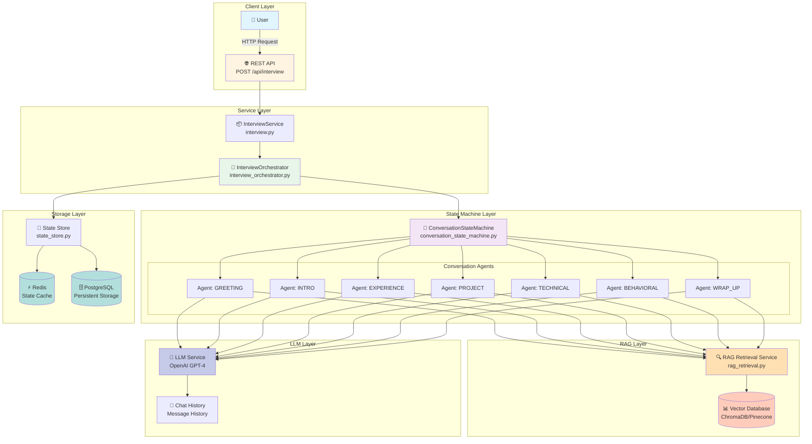

---

## 2. Detailed Request Flow

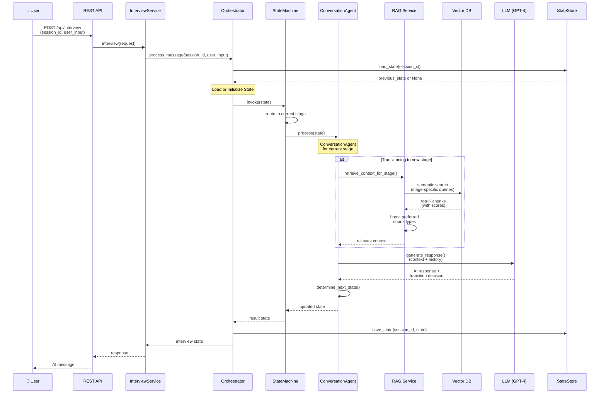

---

## 3. Conversation Agent Internal Flow

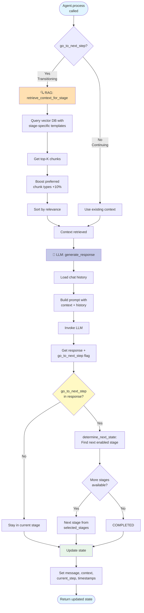

---

## 4. RAG Retrieval Process

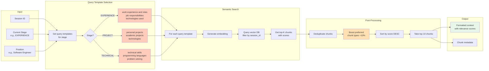

---

## 5. State Machine Transitions

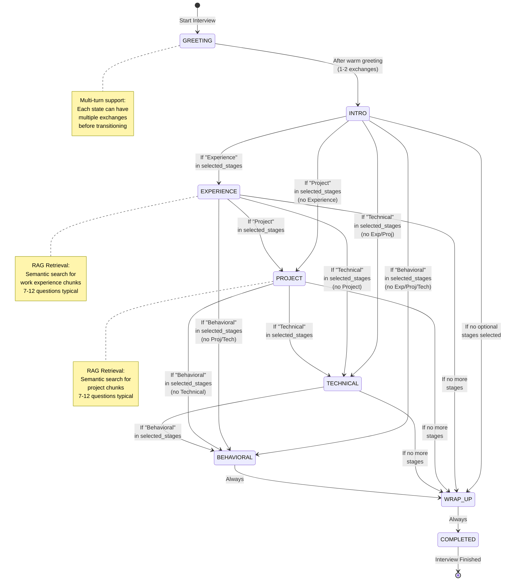

---

## 6. Component Dependency Graph

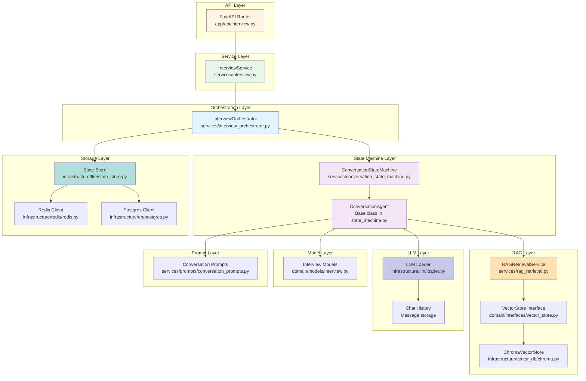

---

## 7. Resume Ingestion Flow

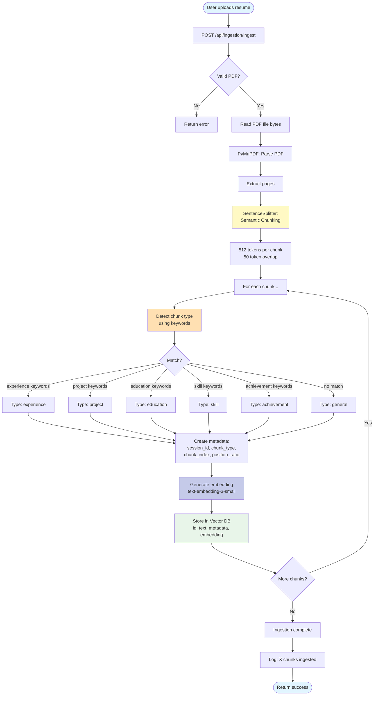

---

## 8. Multi-Turn Conversation Flow

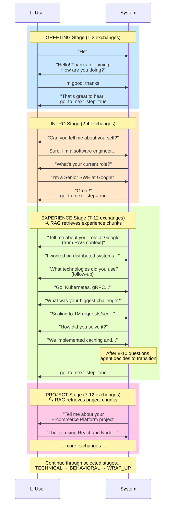

---

## 9. Data Flow: From Resume to Response

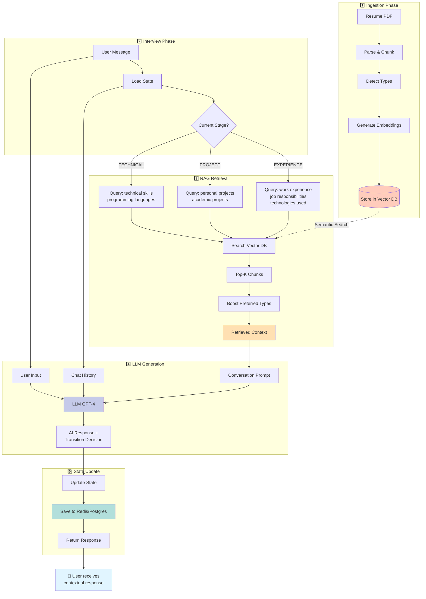

---

## 10. Comparison: Old vs New Architecture

```mermaid
graph TB
    subgraph "❌ OLD ARCHITECTURE"
        OLD1[User Message] --> OLD2[interview_graph.py]
        OLD2 --> OLD3[query_vector_db_node<br/>❌ Doesn't query vector DB!<br/>Just gets JSON from Redis]
        OLD3 --> OLD4[get_example_question_node<br/>Generate 20-25 questions upfront]
        OLD4 --> OLD5[process_answer_node<br/>→ process_graph.py<br/>Just switches prompts<br/>❌ No multi-turn support]
        OLD5 --> OLD6[Response]
    end

    subgraph "✅ NEW ARCHITECTURE"
        NEW1[User Message] --> NEW2[interview_orchestrator.py<br/>Session Management]
        NEW2 --> NEW3[conversation_state_machine.py<br/>State Routing]
        NEW3 --> NEW4[ConversationAgent<br/>for current stage]
        NEW4 --> NEW5A[✅ RAG Retrieval<br/>Actual semantic search]
        NEW4 --> NEW5B[✅ LLM Generation<br/>Natural conversation]
        NEW4 --> NEW5C[✅ Decision<br/>Stay or transition]
        NEW5A & NEW5B & NEW5C --> NEW6[✅ Multi-turn support<br/>Context-aware responses]
        NEW6 --> NEW7[Response]
    end

    style OLD3 fill:#ffcdd2
    style OLD5 fill:#ffcdd2
    style NEW5A fill:#c8e6c9
    style NEW5B fill:#c8e6c9
    style NEW5C fill:#c8e6c9
    style NEW6 fill:#c8e6c9
```

---

## 11. Error Handling Flow

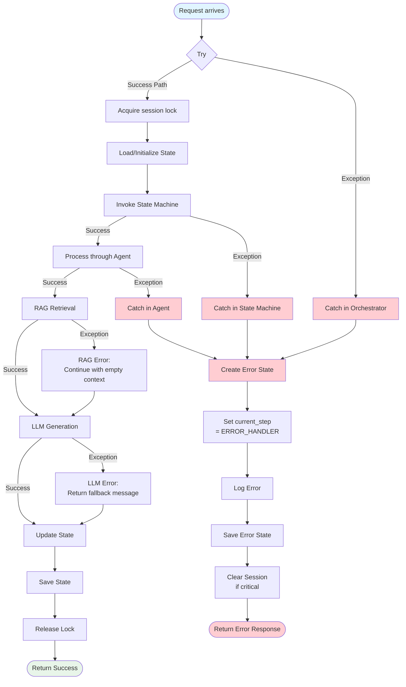

---

## 12. Performance Metrics Comparison

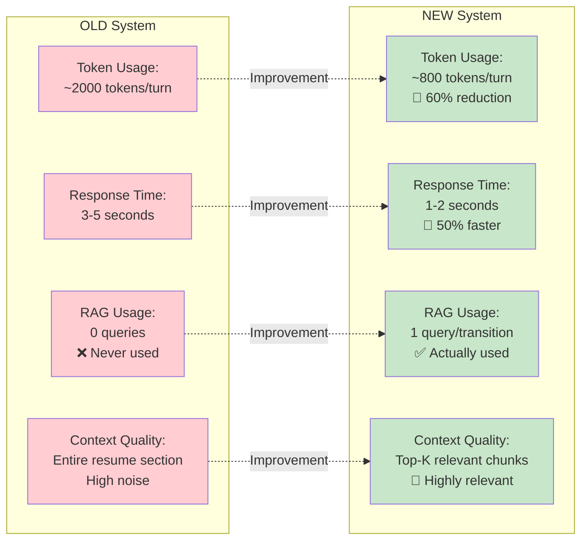

---

## Legend

### Colors
- 🔵 **Blue**: Entry points, user interactions
- 🟢 **Green**: Successful operations, returns
- 🟡 **Yellow**: Decision points, conditionals
- 🟠 **Orange**: RAG operations, retrieval
- 🟣 **Purple**: LLM operations, generation
- 🔴 **Red**: Errors, deprecated components
- 🟢 **Light Green**: Improvements, new features

### Icons
- 👤 User
- 🌐 API/Web
- 📦 Service
- 🎯 Orchestrator
- 🤖 State Machine
- 🔍 RAG/Search
- 🧠 LLM/AI
- 💬 Chat/History
- 📊 Vector Database
- ⚡ Cache (Redis)
- 🗄️ Database (PostgreSQL)
- 📝 State/Storage

---

## How to View These Diagrams

### In VS Code:
1. Install "Markdown Preview Mermaid Support" extension
2. Open this file and click "Preview" button
3. All diagrams will render beautifully!

### In GitHub:
- GitHub automatically renders Mermaid diagrams
- Just push this file and view on GitHub

### Online:
- Copy any diagram code
- Paste into https://mermaid.live/
- Interactive editing and export!

---

## Summary

This architecture uses:
- ✅ **Agent Pattern**: Autonomous conversation agents per stage
- ✅ **RAG Pattern**: Semantic retrieval of relevant context
- ✅ **State Machine Pattern**: Clean state transitions
- ✅ **Orchestrator Pattern**: Centralized coordination
- ✅ **Repository Pattern**: Abstracted storage layer
- ✅ **Strategy Pattern**: Different prompts/strategies per stage

**Result**: A production-ready conversational AI with proper RAG, multi-turn dialogue, and clean architecture! 🚀
